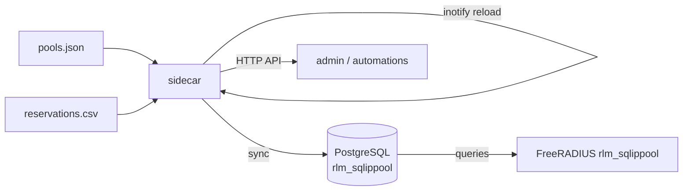

# fr3-dhcp-addons

Kubernetes sidecar that adds dynamic pool management, MAC reservations, and a lease query API to a FreeRADIUS 3.x DHCP server.

## The problem

FreeRADIUS 3.x can serve DHCP via `rlm_sqlippool`, but its built-in pool management has limitations:

- Pool definitions and reservations are static SQL rows — changing them requires manual database writes
- There is no built-in concept of MAC-based reservations that override pool assignment
- There is no management API for querying active leases without direct database access
- Reloading pool config requires a FreeRADIUS restart or `radmin` signal

This sidecar provides a config-file-driven approach: define pools and reservations in plain JSON/CSV files, and the sidecar syncs them to PostgreSQL and reloads on change without touching FreeRADIUS.

## How it works



On startup the sidecar reads `pools.json` and `reservations.csv`, syncs them to the PostgreSQL tables that `rlm_sqlippool` reads from, then watches the config directory for changes and resyncs automatically. It also polls PostgreSQL for active leases and exposes them via a simple HTTP API.

## Configuration files

**pools.json** — define DHCP pools per VLAN:

```json
[
  {
    "vlan_id": 10,
    "name": "servers",
    "network": "192.0.2.0/24",
    "gateway": "192.0.2.1",
    "start": "192.0.2.100",
    "end": "192.0.2.200",
    "lease_duration": 86400
  }
]
```

**reservations.csv** — static MAC-to-IP mappings:

```csv
mac,ip,name,vlan_id
aa:bb:cc:dd:ee:ff,192.0.2.50,my-server,10
```

## Deployment

```yaml
volumes:
  - name: dhcp-pools
    configMap:
      name: dhcp-pools

containers:
  - name: freeradius
    image: freeradius/freeradius-server:3.2
    # rlm_sqlippool configured to use the PostgreSQL instance below

  - name: dhcp-sidecar
    image: ghcr.io/Quxyzzy/fr3-dhcp-addons:latest
    env:
      - name: DB_HOST
        value: "postgres.dhcp-system.svc.cluster.local"
      - name: DB_NAME
        value: "dhcp"
      - name: DB_USER
        value: "app"
      - name: DHCP_SQL_PASSWORD
        valueFrom:
          secretKeyRef:
            name: dhcp-db-credentials
            key: password
      - name: POOLS_FILE
        value: "/data/dhcp-pools/pools.json"
      - name: RESERVATIONS_FILE
        value: "/data/dhcp-pools/reservations.csv"
      - name: SIDECAR_PORT
        value: "8080"
    volumeMounts:
      - name: dhcp-pools
        mountPath: /data/dhcp-pools
    ports:
      - containerPort: 8080
```

## Configuration

| Variable | Default | Description |
|----------|---------|-------------|
| `POOLS_FILE` | `/data/dhcp-pools/pools.json` | Path to pool definitions |
| `RESERVATIONS_FILE` | `/data/dhcp-pools/reservations.csv` | Path to MAC reservations |
| `WATCH_DIR` | `/data/dhcp-pools` | Directory to watch for config changes |
| `DB_HOST` | `dhcp-postgres-rw.dhcp-system.svc.cluster.local` | PostgreSQL host |
| `DB_NAME` | `dhcp` | Database name |
| `DB_USER` | `app` | Database user |
| `DHCP_SQL_PASSWORD` | — | Database password (from environment/secret) |
| `SIDECAR_PORT` | `8080` | HTTP API port |

## API

| Method | Path | Description |
|--------|------|-------------|
| GET | `/healthz` | Liveness probe |
| GET | `/leases` | All active leases |
| GET | `/leases?pool=<name>` | Leases filtered by pool |
| GET | `/pools` | Configured pools |
| GET | `/reservations` | Configured reservations |

## Building

```bash
docker build -t fr3-dhcp-addons .
```
